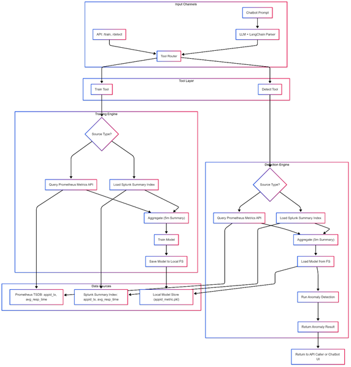
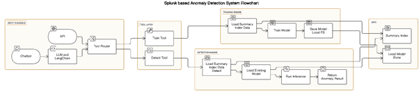
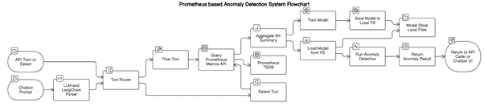
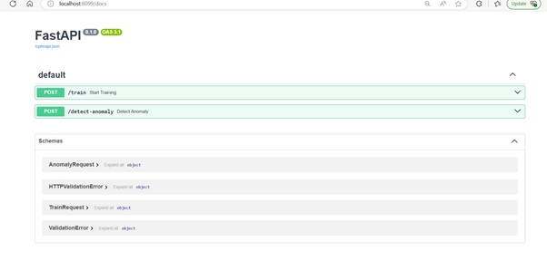
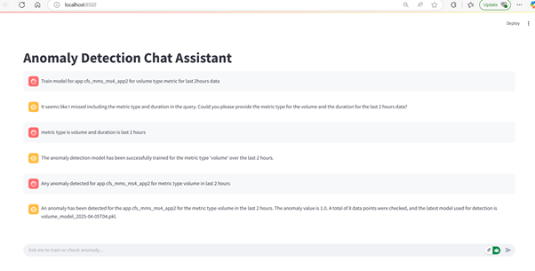

# 🧠 AnomalyAndForecastingEngineLLM

This project is a unified platform that leverages LLMs (Large Language Models) to provide **anomaly detection** and **forecasting** on **time-series data** coming from tools like **Prometheus** and **Splunk**. The system supports both chatbot-style input and API-based interactions, making it easy for users to ask questions or trigger model training/detection workflows.

---

## 🔍 Problem Statement

1. Most monitoring tools today provide limited anomaly detection or forecasting. They are typically **black-box** systems that do not allow customization or support for custom metrics.
2. Time-series health check data is usually point-in-time and cannot project resource/system health over historical windows or forecast into the near future.

---

## ✅ Key Features

- Chatbot + API interface to interact with system health data.
- Train forecasting/anomaly detection models based on historical data.
- Detect anomalies in real time using saved models.
- Support for both **Prometheus** and **Splunk** as time-series sources.
- Modular tool-based design to allow easy extensibility.

---

## 🧩 Project Structure


---

## 💡 How It Works (Simple Flow)

1. **User asks a question** (via UI or API):  
   _"Is there any anomaly in app1 response time over the last hour?"_

2. **LLM Agent** parses the prompt to determine:
   - App ID
   - Metric
   - Duration
   - Task (detect or train)

3. The parsed request is routed via `tools.py` to either:
   - `model_trainer.py` for training, or
   - `anomaly_detector.py` for detection

4. **Data is fetched** from Prometheus/Splunk, summarized into 5-minute buckets.

5. Models are either trained and saved or loaded and used to detect anomalies.

6. **Result is returned** back to the user (via chatbot or API).

---

## 📦 Dependencies

- Python 3.9+
- LangChain
- OpenAI / HuggingFace LLMs
- Prometheus HTTP API / Splunk SDK
- Scikit-learn / Prophet / Statsmodels (for time-series models)
- FastAPI (for API endpoints)

> 💬 Add your own `.env` or `secret_key.py` to securely store API keys and credentials.

---

## 🚀 Getting Started

1. Clone this repository:

```bash
git clone https://github.com/your-username/AnomalyAndForecastingEngineLLM.git
cd AnomalyAndForecastingEngineLLM


## 🧱 High Level Design


## 🧱 Flow Digram: Splunk Source Specific Anomaly Detection Engine


## 🧱 Flow Digram: Prometheus Source Specific Anomaly Detection Engine



## 🖼️ POC Images




## Code Structure

AnomalyAndForecastingEngineLLM/
├── uiapp.py                  # 🖥️ User interface layer (Streamlit or Gradio for chatbot/API interaction)
│
├── agent_setup.py           # 🤖 LLM Agent setup using LangChain
│   └── Imports and uses:
│       ├── tools.py         #    └─ Tool functions registered to LangChain agent
│       └── parser.py        #    └─ Prompt parser to extract app_id, metric_type, duration
│
├── tools.py                 # 🧰 Defines "train" and "detect anomaly" tools
│   ├── Uses:
│   │   ├── model_trainer.py     # ─ For training logic
│   │   ├── anomaly_detector.py  # ─ For detection logic
│   │   └── splunk_utils.py      # ─ For querying Splunk summary index
│
├── parser.py                # 🧠 Parses chatbot/API prompt into structured parameters
│
├── splunk_utils.py          # 🔍 Queries summary index from Splunk (or Prometheus in future)
│
├── model_trainer.py         # 🎓 Trains ML models and saves them locally (per app_id & metric)
│
└── anomaly_detector.py      # 🚨 Loads model, runs inference, returns anomaly results
│
└── fast-api-clientapp*.py      # 🚨 Microservices generate traffic and post to splunk.


## 📁 Module Overview

### `uiapp.py` – Bot UI
This module provides a simple user interface for interacting with the chatbot. Users can trigger training or anomaly detection through natural language prompts or API requests.

### `agent_setup.py`
Initializes the LLM-based agent using LangChain, sets up tool integrations, and connects the chatbot logic with the underlying anomaly detection engine.

### `tools.py`
Contains the actual tool definitions (`/train`, `/detect_anomaly`) which act as callable endpoints used by the LLM agent to perform operations based on user intent.

### `parser.py`
Parses incoming prompts to extract structured parameters like app ID, metric type, and time range using a combination of regex or LLM-based parsing.

### `splunk_utils.py`
Utility module for querying data from Splunk’s summary index. It supports both training and inference data extraction for downstream use.

### `anomaly_detector.py`
Loads trained models, runs inference on new data, and identifies anomalies. It returns a human-readable result indicating if the input data deviates from learned behavior.

### `model_trainer.py`
Handles training logic for building time-series anomaly detection models. It saves trained models locally, indexed by app ID and metric type.
